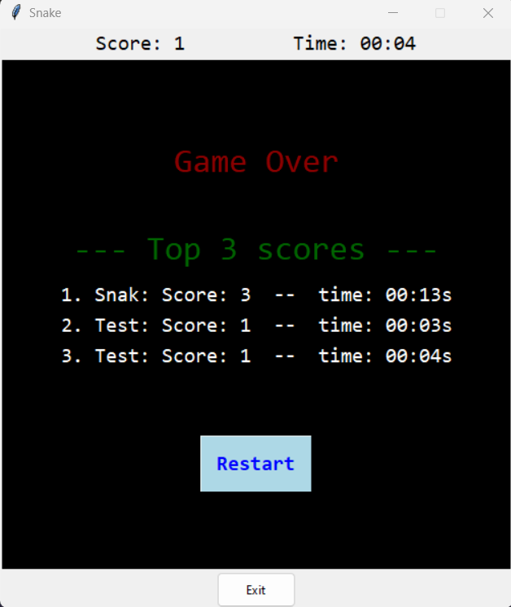

# classic Snake game

### Building the classic snake game with Tkinter module).

- The game is as usual the snake grows when eating an apple. and is done so  with checking and udating coordinates of the block representations for the objects Snake and Food.

- Two different game options (1: Wall limit is off. 2: Wall limit is on.) (New feature) 

- Timer and Score widgets. Reset to 0 on a new party.
- Restart button feature for continous running of the program without having to quit and re run.
- Pause/ Resume feature.
- Best score saved (new Feature added.) - show the top 3 score at the end, in the console at the moment.

self.BASE_SPEED and self.MAX_SPEED can be edited at the top of the Game class 
-   BASE_speed to change the speed of the game at the beginning.
-   MAX_SPEED Set how fast the snake will move at it's maximum speed.
- 

'Start of program'

'choose the game's setting.'

'Pause/Resume button active'

'user enter their names.'

'Game over'

