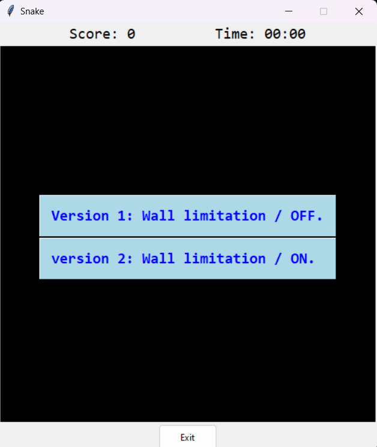
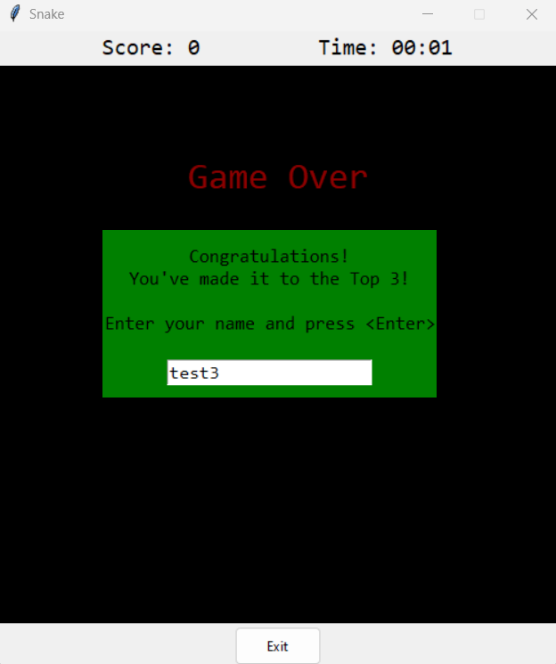

# classic Snake game

Building the classic snake game using (and learning Tkinter module).

- The game is as usual the snake grows when eating an apple. and is done so  with checking and udating coordinates of the block representations for the objects Snake and Food.

- Two different game options (1: Wall limit is off. 2: Wall limit is on.) (New feature) 

- Timer and Score widgets. Reset to 0 on a new party.
- Restart button feature for continous running of the program without having to quit and re run.
- Pause/ Resume feature.

self.BASE_SPEED and self.MAX_SPEED can be edited at the top of the Game class 
-   BASE_speed to change the speed of the game at the beginning.
-   MAX_SPEED to change how fast the snake moves as the score increases.

'Start of program/choose the game's setting.'

'Start button/Ready to start'

'Pause/Resume button active'

'Game over'

