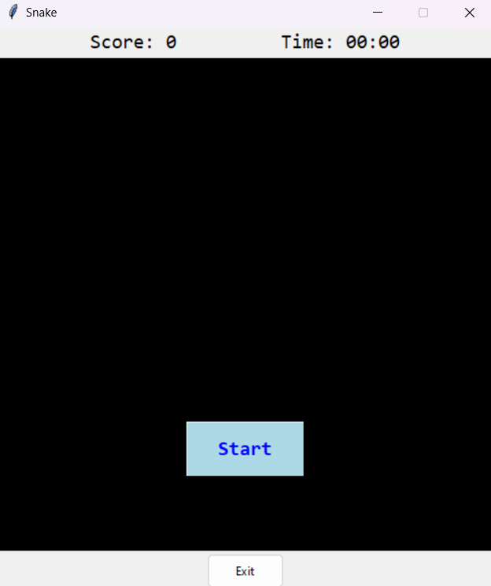

# classic Snake game

Building the classic snake game using (and learning Tkinter module).

- The game is as usual the snake grows when eating an apple. and is done so  with checking and udating coordinates of the block representations for the objects Snake and Food.

- Timer and score are set up. and reset for new game run.
- As a restart button implementation for continous running of the program without having to quit and re run.

